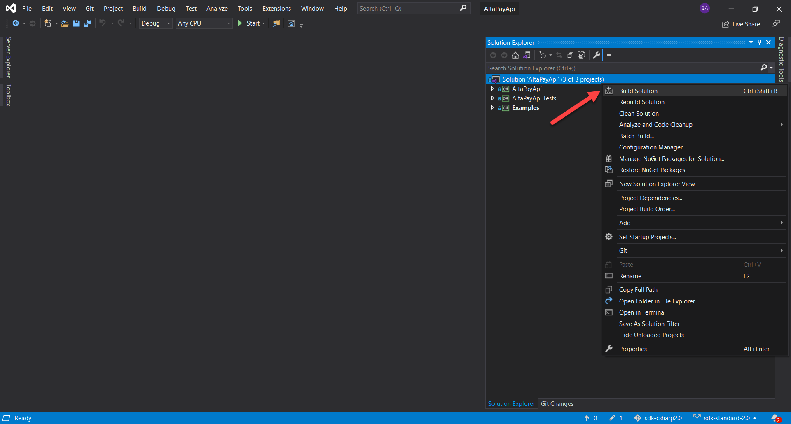

# AltaPay - API C# (C-Sharp) 2.0

C# (C-Sharp) is a Client library that is used as a bridge between customer .Net solutions and AltaPay gateway.

## Compatibility
- .NetFramework 4.6.1 and above

    For .NetFramework below 4.6.1 please see [API C# (C-Sharp)](https://github.com/AltaPay/sdk-csharp)

## How to Build

### Using Visual Studio

1. Clone the repository 

        $ git clone https://github.com/AltaPay/sdk-csharp2.0.git

2. Open Visual Studio 2019 and go to File → Open → Project/Solution.

3. Select the .sln file located in the Altapay directory.

4. Right-click on the solution file and click Build Solution to build the package.

    

### Using Vagrant

> To build using any operating system, install [VirtualBox](https://www.virtualbox.org/wiki/Downloads) and [Vagrant](https://www.vagrantup.com/downloads) for your operating system.
 
1. Clone the repository

        $ git clone https://github.com/AltaPay/sdk-csharp2.0.git

2. Start the build process by traversing to the repository directory from the terminal and run:

        $ ./start_build.sh

3.  Above bash script generates the zip file **AltaPay_build.zip** in the repository directory. 

## Changelog

See [Changelog](CHANGELOG.md) for all the release notes.

## License

Distributed under the MIT License. See [LICENSE](LICENSE) for more information.

## Documentation

For more details please see [AltaPay docs](https://documentation.altapay.com/)
